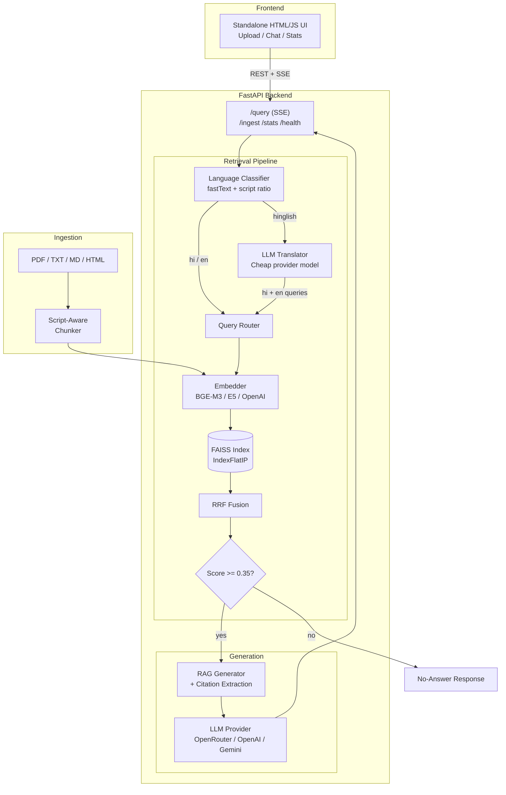

# Multilingual RAG System — Hindi-English Cross-Lingual Retrieval

A production-grade Retrieval-Augmented Generation system that handles queries in Hindi, English, or code-switched Hinglish. Cross-lingual retrieval lets a Hindi question surface relevant English documents, and vice versa. The app ships with a FastAPI backend, FAISS-backed retrieval, streaming generation, and a lightweight standalone HTML/JS frontend.

## Features

- [x] Script-aware recursive chunker (Devanagari + Latin, danda-aware sentence splitting)
- [x] BGE-M3 multilingual dense embeddings (1024-d, self-hosted)
- [x] Multilingual-E5-large embeddings (1024-d, with query/passage prefixes)
- [x] OpenAI text-embedding-3-large support (3072-d, with native dim reduction)
- [x] FAISS vector store (IndexFlatIP + IVF-PQ, save/load with sqlite metadata)
- [x] fastText language classifier (Hindi / English / Hinglish detection)
- [x] Cross-lingual retrieval with dual-query strategy for Hinglish
- [x] Reciprocal Rank Fusion (RRF) for multi-query result merging
- [x] Relevance threshold gating (no-answer detection)
- [x] Streaming LLM generation through OpenAI-compatible providers, OpenRouter, or Gemini
- [x] LLM-backed translation for Hinglish dual-query strategy
- [x] FastAPI backend with SSE streaming
- [x] Standalone HTML/JS frontend with upload, chat, stats, citations, and SSE streaming
- [x] Cross-lingual benchmark framework (MIRACL-hi + XOR-TyDi)
- [x] Embedding model comparison (BGE-M3 vs multilingual-e5 vs OpenAI)
- [ ] RAGAS evaluation (framework ready, requires running with API keys)
- [x] Docker Compose deployment

## Architecture



## Tech Stack

| Layer | Technology | Version |
|---|---|---|
| Language | Python | 3.11 |
| Dependency management | uv | latest |
| Embeddings (primary) | BGE-M3 (sentence-transformers) | 3.2.1 |
| Embeddings (comparison) | multilingual-e5-large (sentence-transformers) | 3.2.1 |
| Embeddings (comparison) | OpenAI text-embedding-3-large | API |
| Vector store | FAISS (CPU) | 1.8.0 |
| LLM providers | OpenAI-compatible APIs, OpenRouter, Gemini | openai 1.54.4, google-generativeai 0.8.3 |
| Language ID | fastText lid.176.bin | fasttext-wheel 0.9.2 |
| API framework | FastAPI + SSE | 0.115.4 |
| Frontend | Standalone HTML/JS (served by Python) | — |
| Evaluation | RAGAS + MIRACL + XOR-TyDi | ragas 0.2.6 |
| Deployment | Docker Compose | 3.x |

## Quickstart

### With Docker (recommended)

```bash
# 1. Clone and enter the project
git clone <repo-url>
cd multilingual-rag

# 2. Configure environment
cp .env.example .env
# Edit .env — add OPENAI_API_KEY for OpenRouter/OpenAI or GEMINI_API_KEY for Gemini

# 3. Download runtime models (fastText lid.176.bin, ~125 MB)
bash scripts/download_models.sh

# 4. Start everything
make docker-up

# 5. Open in browser
#    Frontend: http://localhost:7860
#    Backend:  http://localhost:8000/health
```

### Without Docker (local dev)

```bash
# 1. Prerequisites: Python 3.11+, uv
curl -LsSf https://astral.sh/uv/install.sh | sh

# 2. Install dependencies
cd multilingual-rag
make install

# 3. Configure environment
cp .env.example .env
# Edit .env — add OPENAI_API_KEY for OpenRouter/OpenAI or GEMINI_API_KEY for Gemini

# 4. Download runtime models
bash scripts/download_models.sh

# 5. Run tests (all external API calls are mocked)
make test

# 6. Start backend (terminal 1)
make run
# Wait for "Application startup complete" before proceeding

# 7. Start frontend (terminal 2)
make frontend
# 8. Open http://localhost:7860
#    Both servers must be running — frontend (:7860) talks to backend (:8000)
```

> **Note:** The backend must be running before using the frontend. The frontend
> makes API calls to `http://localhost:8000`. If you see "Connection failed"
> errors, ensure the backend is started and healthy (`curl http://localhost:8000/health`).

### Run Evaluation

```bash
# Full evaluation: downloads benchmarks, embeds, scores
make eval

# Or step-by-step:
cd backend
uv run python ../scripts/prepare_benchmark.py --max-queries 100 --distractors 2000
uv run python ../scripts/run_eval.py --compare --embedders bge-m3 e5
```

Results are written to `eval_results/` and `REPORT.md`.

## API Overview

The backend exposes a compact HTTP API:

| Method | Path | Purpose |
|---|---|---|
| `GET` | `/health` | Service health, index-loaded state, and active LLM label |
| `GET` | `/stats` | Index size, embedder, vector-store type, languages, and LLM label |
| `POST` | `/ingest` | Upload `.txt`, `.md`, `.html`, or `.pdf` content for chunking and indexing |
| `POST` | `/query` | SSE-streamed RAG answer with `sources`, `token`, `citations`, `error`, and `done` events |

See [docs/API.md](docs/API.md) for request examples and the SSE event contract.

## Evaluation Results

> All benchmark numbers come from real runs. Values below are placeholders
> until the full evaluation is executed. No numbers are fabricated — see
> [REPORT.md](REPORT.md) for methodology and disclosure.

### Embedding Comparison (MIRACL-hi + XOR-TyDi mini benchmark)

| Embedding Model | Recall@1 | Recall@5 | Recall@10 | MRR@10 | nDCG@10 |
|---|---|---|---|---|---|
| BGE-M3 (dense) | `<TO_BE_FILLED_BY_RUNNER>` | `<TO_BE_FILLED_BY_RUNNER>` | `<TO_BE_FILLED_BY_RUNNER>` | `<TO_BE_FILLED_BY_RUNNER>` | `<TO_BE_FILLED_BY_RUNNER>` |
| multilingual-e5-large | `<TO_BE_FILLED_BY_RUNNER>` | `<TO_BE_FILLED_BY_RUNNER>` | `<TO_BE_FILLED_BY_RUNNER>` | `<TO_BE_FILLED_BY_RUNNER>` | `<TO_BE_FILLED_BY_RUNNER>` |
| OpenAI text-embedding-3-large | `<TO_BE_FILLED_BY_RUNNER>` | `<TO_BE_FILLED_BY_RUNNER>` | `<TO_BE_FILLED_BY_RUNNER>` | `<TO_BE_FILLED_BY_RUNNER>` | `<TO_BE_FILLED_BY_RUNNER>` |

### RAGAS Generation Quality

| Metric | Score |
|---|---|
| Faithfulness | `<TO_BE_FILLED_BY_RUNNER>` |
| Answer Relevancy | `<TO_BE_FILLED_BY_RUNNER>` |
| Context Precision | `<TO_BE_FILLED_BY_RUNNER>` |
| Context Recall | `<TO_BE_FILLED_BY_RUNNER>` |

Judge: `gpt-4o-mini`. Sample size: `<TO_BE_FILLED_BY_RUNNER>` queries.

## Project Structure

```
multilingual-rag/
├── backend/
│   ├── app/
│   │   ├── __init__.py
│   │   ├── config.py                    # pydantic-settings, .env loading
│   │   ├── logging_setup.py             # centralized logging config
│   │   ├── main.py                      # FastAPI app + lifespan
│   │   ├── ingestion/
│   │   │   ├── __init__.py
│   │   │   └── chunker.py              # ScriptAwareRecursiveChunker
│   │   ├── embeddings/
│   │   │   ├── __init__.py              # get_embedder factory
│   │   │   ├── base.py                 # EmbeddingModel ABC
│   │   │   ├── bge_m3.py               # BGE-M3 (sentence-transformers)
│   │   │   ├── e5.py                   # multilingual-e5-large
│   │   │   └── openai_embed.py          # text-embedding-3-large
│   │   ├── retrieval/
│   │   │   ├── __init__.py
│   │   │   ├── vector_store.py          # FaissStore (flat + IVF-PQ)
│   │   │   ├── retriever.py            # DenseRetriever
│   │   │   ├── language_classifier.py   # fastText + script-ratio
│   │   │   ├── query_router.py         # direct / dual-query strategy
│   │   │   ├── rrf.py                  # Reciprocal Rank Fusion
│   │   │   └── threshold.py            # relevance threshold gating
│   │   ├── generation/
│   │   │   ├── __init__.py
│   │   │   ├── llm_base.py             # LLMProvider ABC
│   │   │   ├── gemini_provider.py      # Google Gemini
│   │   │   ├── openai_provider.py      # OpenAI
│   │   │   ├── factory.py              # auto-fallback provider factory
│   │   │   ├── prompts.py              # RAG + translation prompts
│   │   │   ├── generator.py            # RAGGenerator (sync + streaming)
│   │   │   └── translator.py           # LLM-backed translator
│   │   ├── api/
│   │   │   ├── __init__.py
│   │   │   ├── routes.py               # /health /stats /ingest /query
│   │   │   └── schemas.py              # Pydantic request/response models
│   │   └── eval/
│   │       ├── __init__.py
│   │       ├── metrics.py              # recall@k, mrr@k, ndcg@k
│   │       ├── benchmark.py            # unified benchmark loader + runner
│   │       ├── embedding_compare.py    # head-to-head embedder comparison
│   │       └── report.py               # REPORT.md + JSON writer
│   ├── tests/                           # pytest suite with mocked external APIs
│   ├── data/
│   │   ├── models/                      # fastText lid.176.bin (gitignored)
│   │   ├── index/                       # FAISS indices (gitignored)
│   │   ├── sample_corpus/               # Wikipedia articles (gitignored)
│   │   └── benchmark/                   # MIRACL/XOR-TyDi JSONL (gitignored)
│   ├── pyproject.toml
│   └── Dockerfile
├── frontend/
│   ├── app.py                           # HTTP server (serves index.html)
│   ├── index.html                       # Standalone HTML/CSS/JS UI
│   ├── requirements.txt
│   └── Dockerfile
├── scripts/
│   ├── download_models.sh               # fastText model download
│   ├── download_sample_corpus.py        # Wikipedia hi/en article pairs
│   ├── prepare_benchmark.py             # MIRACL + XOR-TyDi → JSONL
│   ├── build_index.py                   # embed corpus → FAISS index
│   ├── run_eval.py                      # single / compare eval modes
│   └── run_full_eval.sh                 # end-to-end eval pipeline
├── docker-compose.yml
├── Makefile
├── .env.example
├── .gitignore
├── docs/
│   ├── API.md                           # backend API and SSE contract
│   └── LOCAL_DEVELOPMENT.md             # setup, indexing, testing, troubleshooting
├── REPORT.md                            # evaluation report template / generated results
├── CONTRIBUTING.md
├── LICENSE                              # MIT
└── README.md
```

## Screenshots

Screenshots can be added after a deployed or demo-ready run is available.

## Datasets and Licenses

| Dataset | License | Link |
|---|---|---|
| MIRACL (Hindi subset) | CC-BY-SA 4.0 | [miracl/miracl](https://huggingface.co/datasets/miracl/miracl) |
| XOR-TyDi QA | CC-BY-SA 4.0 | [nlp.cs.washington.edu/xorqa](https://nlp.cs.washington.edu/xorqa/) |
| Wikipedia (hi + en) | CC-BY-SA 4.0 | [dumps.wikimedia.org](https://dumps.wikimedia.org/) |

The sample corpus is fetched via the Wikipedia API for educational / research purposes.
Benchmark evaluation uses scaled-down subsets of MIRACL and XOR-TyDi — see
[REPORT.md](REPORT.md) for methodology and full disclosure.

## Development Notes

- **Two servers required:** Backend (:8000) must be running before the frontend (:7860) can function. The frontend makes cross-origin requests to the backend API.
- **Frontend architecture:** Pure HTML/CSS/JS served by a minimal Python HTTP server. No framework dependencies — all rendering is done client-side with vanilla JS and SSE streaming.
- **Provider configuration:** The default OpenAI-compatible configuration can point at OpenRouter through `OPENAI_BASE_URL`; leave that value empty when calling OpenAI directly.
- Heavy benchmarks (BGE-M3 embedding, RAGAS generation) run on the user's machine, not in CI.
- All eval numbers in this README come from real runs — see `eval_results/` for raw outputs.
- Tests use a tiny tokenizer download (~5 MB) but never download the full embedding model.
- The test suite mocks all LLM API calls — zero real API usage in pytest.
- macOS: torch + faiss-cpu ship duplicate libomp; tests set `KMP_DUPLICATE_LIB_OK=TRUE` automatically.
- macOS: IVF-PQ tests are skipped due to torch/faiss OpenMP conflict during FAISS training.

## License

MIT — see [LICENSE](LICENSE).
